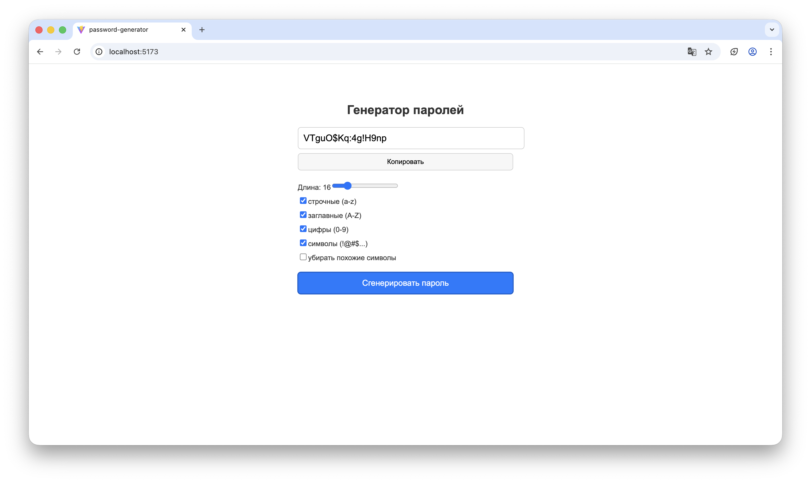

# 📘 Password Generator

Простое приложение на **Vite + React + TypeScript** для генерации случайных безопасных паролей.
Пользователь может выбрать длину пароля, включаемые типы символов и исключать похожие символы.
Готовый пароль удобно копируется в буфер обмена одной кнопкой.

---

## ✨ Возможности приложения

* Генерация случайных паролей любой длины (от 4 до 64 символов)
* Поддержка различных наборов символов:

  * строчные буквы
  * заглавные буквы
  * цифры
  * специальные символы
* Опция «убрать похожие символы»
* Копирование пароля в один клик
* Простая светлая минималистичная UI-верстка

---

## 🧰 Используемые технологии

* **Vite** — быстрая сборка и запуск дев-сервера
* **React** — создание интерфейса
* **TypeScript** — типизация и надёжность
* **CSS** — лёгкие стили без фреймворков

---

## 📁 Структура проекта

Использована структура **точь-в-точь как на твоём проекте**:

```
PASSWORD-GENERATOR/
├── node_modules/
│
├── public/
│   └── vite.svg
│
├── src/
│   ├── assets/                
│   ├── App.css                
│   ├── App.tsx                
│   ├── index.css             
│   ├── main.tsx               
│   └── passwordGenerator.tsx  
├── .gitignore
├── eslint.config.js
├── index.html
├── package.json
├── package-lock.json
├── README.md
├── tsconfig.json
├── tsconfig.app.json
├── tsconfig.node.json
└── vite.config.ts
```

---

## 🧩 Как работает генерация пароля

В файле `src/passwordGenerator.tsx`:

* формируется набор возможных символов по выбранным опциям пользователя
* генерируется пароль нужной длины путём выбора символов по случайным индексам

Эта функция вызывается из `App.tsx` при нажатии кнопки «Сгенерировать пароль».

---

## 📸 Скриншоты приложения


